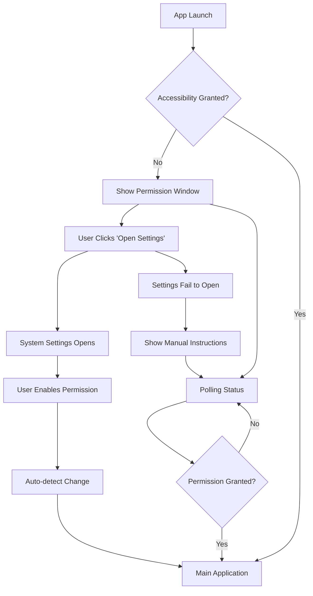

# Design Document

## Overview

This design transforms the current accessibility permission onboarding experience from a complex debug-focused interface to a streamlined, user-friendly flow. The new design replaces the existing OnboardingView component with a simplified permission window that focuses on clear communication, direct system integration, and automatic progression.

The solution leverages existing Tauri backend functions (`check_accessibility`, `prompt_accessibility`) and system URL opening capabilities while introducing a cleaner UI and improved user experience flow.

## Architecture

### Component Structure

```
AccessibilityPermissionFlow/
├── PermissionWindow.tsx          # Main simplified permission interface
├── PermissionStatus.tsx          # Status detection and polling logic
└── usePermissionFlow.ts          # Custom hook for permission state management
```

### State Management

The permission flow uses a custom React hook (`usePermissionFlow`) that manages:
- Permission status polling
- Automatic transition logic
- Error handling and recovery
- System settings integration

### Integration Points

- **Existing Tauri Commands**: Reuses `check_accessibility()` and system URL opening
- **Main App Flow**: Integrates with existing app routing to transition to main interface
- **System Integration**: Uses `openUrl` with macOS system preferences URL scheme

## Components and Interfaces

### PermissionWindow Component

```typescript
interface PermissionWindowProps {
  onPermissionGranted: () => void;
  onError?: (error: string) => void;
}

interface PermissionState {
  isGranted: boolean;
  isChecking: boolean;
  error: string | null;
}
```

**Key Features:**
- Clean, minimal UI with clear messaging
- Single prominent "Open System Settings" button
- Automatic status detection without debug information
- Smooth transitions and loading states

### PermissionStatus Component

```typescript
interface PermissionStatusProps {
  onStatusChange: (granted: boolean) => void;
  pollingInterval?: number;
}
```

**Responsibilities:**
- Polls accessibility permission status using existing `check_accessibility`
- Handles automatic detection of permission changes
- Manages polling lifecycle (start/stop/cleanup)
- Provides status updates to parent components

### usePermissionFlow Hook

```typescript
interface UsePermissionFlowReturn {
  isGranted: boolean;
  isLoading: boolean;
  error: string | null;
  openSystemSettings: () => Promise<void>;
  checkPermission: () => Promise<void>;
  resetError: () => void;
}
```

**Features:**
- Encapsulates all permission-related logic
- Handles system settings URL opening
- Manages error states and recovery
- Provides clean API for components

## Data Models

### Permission State Model

```typescript
type PermissionStatus = 'unknown' | 'denied' | 'granted' | 'checking';

interface PermissionFlowState {
  status: PermissionStatus;
  lastChecked: Date | null;
  error: string | null;
  hasUserInteracted: boolean;
}
```

### System Integration Model

```typescript
interface SystemSettingsIntegration {
  url: string;
  fallbackInstructions: string[];
  isSupported: boolean;
}

const MACOS_ACCESSIBILITY_SETTINGS: SystemSettingsIntegration = {
  url: "x-apple.systempreferences:com.apple.preference.universalaccess",
  fallbackInstructions: [
    "Open System Preferences/Settings",
    "Navigate to Privacy & Security",
    "Select Accessibility",
    "Enable permission for this app"
  ],
  isSupported: true
};
```

## Error Handling

### Error Categories

1. **System Settings Opening Failures**
   - Fallback to manual instructions
   - Clear step-by-step guidance
   - Retry mechanism

2. **Permission Detection Failures**
   - Graceful degradation to manual refresh
   - Error messaging without technical details
   - Recovery options

3. **Polling Failures**
   - Automatic retry with exponential backoff
   - Fallback to manual status checking
   - User notification of issues

### Error Recovery Strategies

```typescript
interface ErrorRecoveryStrategy {
  maxRetries: number;
  retryDelay: number;
  fallbackAction: () => void;
  userMessage: string;
}
```

## Testing Strategy

### Unit Tests
- Permission status detection logic
- System settings URL generation
- Error handling scenarios
- State management in custom hook

### Integration Tests
- Component interaction with Tauri backend
- System settings opening functionality
- Permission status polling behavior
- Transition to main application

### User Experience Tests
- Permission flow completion time
- Error recovery user paths
- Accessibility compliance
- Cross-platform behavior (macOS focus)

## Implementation Approach

### Phase 1: Core Components
1. Create simplified PermissionWindow component
2. Implement usePermissionFlow hook
3. Add system settings integration
4. Replace existing OnboardingView

### Phase 2: Enhanced Experience
1. Add smooth transitions and animations
2. Implement comprehensive error handling
3. Add accessibility features
4. Optimize polling performance

### Phase 3: Polish and Testing
1. Comprehensive testing suite
2. User experience refinements
3. Performance optimizations
4. Documentation updates

## User Experience Flow



## Technical Considerations

### Performance
- Efficient polling with reasonable intervals (1.5s based on existing code)
- Automatic cleanup of polling timers
- Minimal re-renders through optimized state management

### Security
- No storage of sensitive permission data
- Secure system URL handling
- Proper error message sanitization

### Accessibility
- Full keyboard navigation support
- Screen reader compatibility
- High contrast support
- Clear focus indicators

### Platform Compatibility
- macOS-specific implementation
- Graceful handling of unsupported platforms
- Future extensibility for other operating systems

## Migration Strategy

### Backward Compatibility
- Maintain existing Tauri command interfaces
- Preserve debug functionality in development mode
- Gradual rollout with feature flags

### Rollout Plan
1. Implement new components alongside existing ones
2. A/B test with subset of users
3. Full replacement of OnboardingView
4. Remove deprecated debug interface

This design provides a foundation for a significantly improved accessibility permission experience while leveraging existing backend infrastructure and maintaining system reliability.